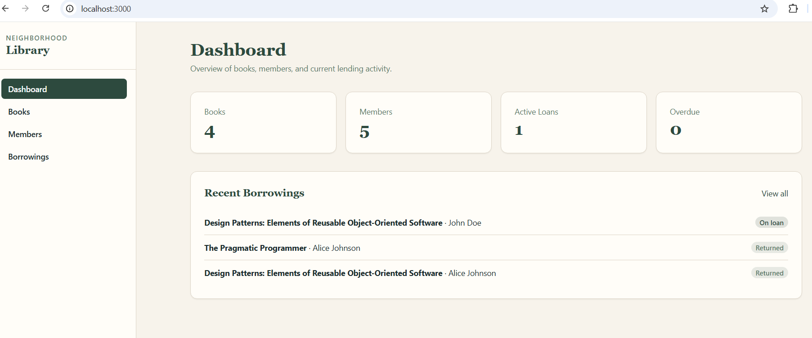
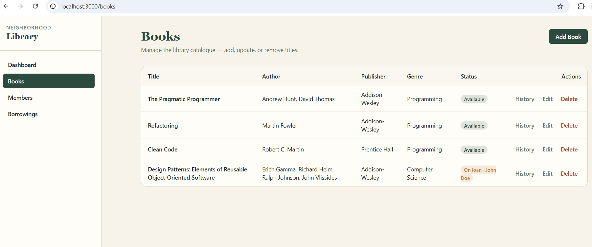
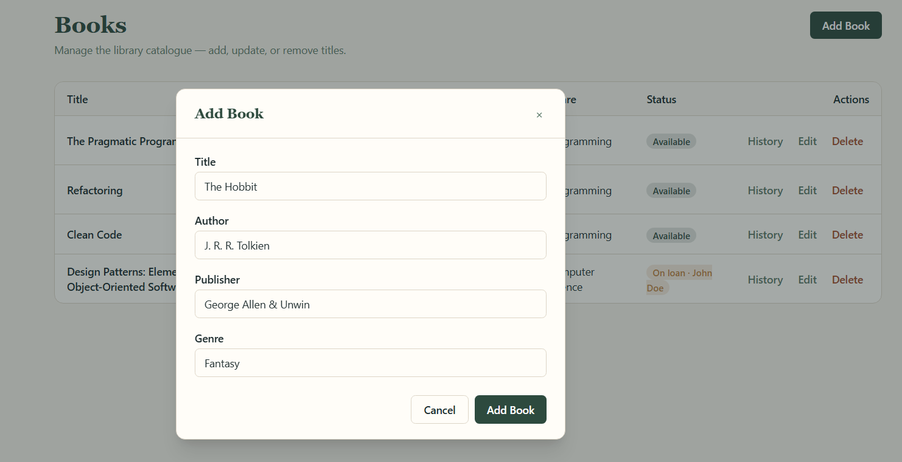
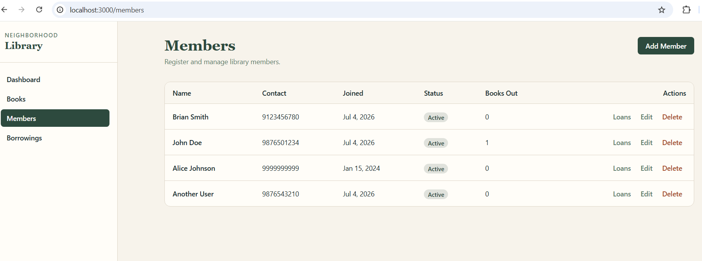
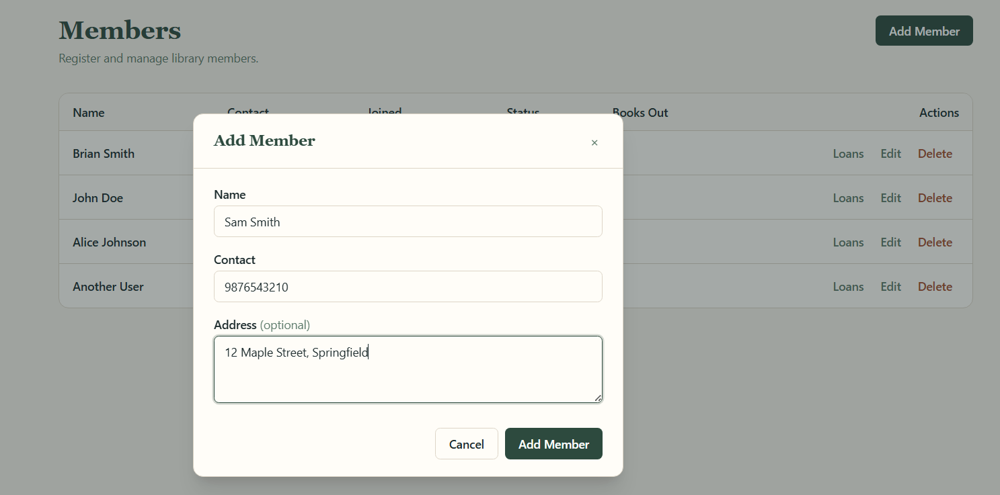
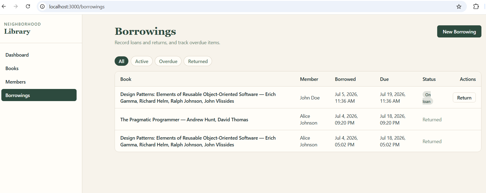
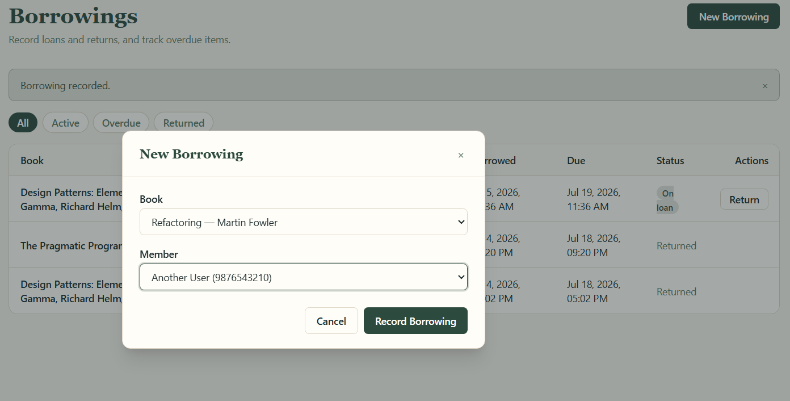

# Neighborhood Library App

A full-stack library management application built with **FastAPI**, **PostgreSQL**, and **Next.js**.

The application allows librarians to manage books, members, and borrowings through a REST API and a web-based staff portal.

---

## Tech Stack

### Backend

* Python 3.12
* FastAPI
* SQLAlchemy 2.x
* PostgreSQL
* Pydantic v2
* uv

### Frontend

* React
* Next.js

---

## Features

### ✅ Implemented

## Features

| Category         | Functionality                                                     |
| ---------------- | ----------------------------------------------------------------- |
| **Books**        | Create, retrieve, update, and delete books                        |
| **Members**      | Create, retrieve, update, and delete members                      |
| **Borrowings**   | Record borrowings, return books, calculate fines, track due dates |
| **Queries**      | View active, returned, and overdue borrowings                     |
| **History**      | View borrowing history by member and by book                      |
| **Availability** | Check book availability and identify the current borrower         |
| **Database**     | PostgreSQL with SQLAlchemy 2.x ORM                                |
| **Validation**   | Request/response validation with Pydantic v2                      |
| **Testing**      | Unit and integration tests for backend APIs                       |
| **Frontend**     | Next.js staff portal for managing books, members, and borrowings  |

---

## Project Structure

```text
backend/
│
├── app/
│   ├── api/
│   ├── models/
│   ├── schemas/
│   ├── database.py
│   ├── config.py
│   └── main.py
│
└── tests/

database/
│
└── schema.sql

frontend/
│
├── src/
│   ├── app/
│   ├── components/
│   └── lib/
│
├── package.json
└── next.config.ts

pyproject.toml
uv.lock
README.md
```

---

# Backend Setup

## 1. Clone the repository

```bash
git clone <repository-url>
cd neighbourhood_library
```

---

## 2. Install uv

If you don't already have `uv` installed:

```bash
pip install uv
```

Alternatively, install it using `pipx`:

```bash
pipx install uv
```

---

## 3. Install dependencies

Install all project dependencies:

```bash
uv sync
```

This command automatically:

* creates a virtual environment (`.venv`) if one doesn't exist,
* installs all dependencies from `uv.lock`,
* ensures a reproducible environment.

---

## 4. Configure environment variables

Create a `.env` file in the project root.

Example:

```env
DB_HOST=localhost
DB_PORT=5432
DB_NAME=library
DB_USER=postgres
DB_PASSWORD=your_password
```

---

## 5. Create the database

Create a PostgreSQL database named `neighbourhood_library`.

Execute `database/schema.sql` against the database using your preferred PostgreSQL client (e.g. psql, pgAdmin Query Tool, or another SQL client).

Example using `psql`:l

```text
psql -U postgres -d neighbourhood_library -f database/schema.sq
```

to create all required tables.

---

## 6. Run the backend

```bash
uv run uvicorn backend.app.main:app --reload
```

The API will be available at:

```text
http://localhost:8000
```

Interactive API documentation:

```text
http://localhost:8000/docs
```
An OpenAPI specification is also available at:

```text
http://localhost:8000/openapi.json
```
---

## 7. Run Backend Tests

The backend tests use a dedicated PostgreSQL database and refuse to run if the configured database name does not end with `_test`.

### Create the test database

Create a PostgreSQL database named `neighbourhood_library_test`.

Execute `database/schema.sql` against the test database using your preferred PostgreSQL client (e.g. `psql`, pgAdmin Query Tool, or another SQL client).

Example using `psql`:

```text
psql -U postgres -d neighbourhood_library_test -f database/schema.sql
```

Populate the test database with the initial test data by executing `database/test_seed.sql`.

Example using `psql`:

```text
psql -U postgres -d neighbourhood_library_test -f database/test_seed.sql
```

### Configure the test environment

Copy:

```text
.env.test.example
```

to:

```text
.env.test
```

Update the PostgreSQL connection details to point to the test database.

### Run the tests

```bash
uv run pytest backend/tests
```

The test suite truncates and reseeds only the configured test database before each test to ensure tests are isolated and repeatable.

> **Never point `.env.test` to your development database.**
---

## Dependency Management

This project uses **uv** for dependency management.

| Task                                       | Command                  |
| ------------------------------------------ | ------------------------ |
| Install dependencies                       | `uv sync`                |
| Add a dependency                           | `uv add <package>`       |
| Add a development dependency               | `uv add --dev <package>` |
| Remove a dependency                        | `uv remove <package>`    |
| Regenerate lock file                       | `uv lock`                |
| Upgrade dependencies                       | `uv lock --upgrade`      |
| Run any command in the project environment | `uv run <command>`       |

Project dependency files:

* `pyproject.toml` — project metadata and dependency specifications
* `uv.lock` — locked dependency versions for reproducible builds

---

# Frontend Setup

The staff portal is a **Next.js** application located in the `frontend/` directory.

The frontend communicates with the FastAPI backend. CORS is enabled during local development for requests originating from `localhost:3000`

## Prerequisites

* Node.js 18+
* npm

---

## 1. Install dependencies

```bash
cd frontend
npm install
```

---

## 2. Configure environment

Copy the example environment file:

```bash
cp .env.local.example .env.local
```

Default configuration:

```env
BACKEND_URL=http://localhost:8000
```

---

## 3. Run the frontend

Start the backend first, then run:

```bash
npm run dev
```

The frontend will be available at:

```text
http://localhost:3000
```

---

## Frontend Pages

| Page       | Path          | Description                                                               |
| ---------- | ------------- | ------------------------------------------------------------------------- |
| Dashboard  | `/`           | Summary statistics and recent borrowings                                  |
| Books      | `/books`      | Manage books, availability, and borrowing history                         |
| Members    | `/members`    | Manage members and view active borrowings                                 |
| Borrowings | `/borrowings` | Record loans and returns, filter active, overdue, and returned borrowings |

---

## Production Build

```bash
cd frontend
npm run build
npm start
```
## Screenshots

### Dashboard

Provides an overview of the library, including key statistics and recent borrowing activity.



---

### Books

Manage the library's book catalogue, including creating, editing, deleting books, and viewing availability and borrowing history.




---

### Members

Manage library members, update member details, and view active or historical borrowings.




---

### Borrowings

Record new borrowings, return books, and view active, returned, and overdue borrowings.



